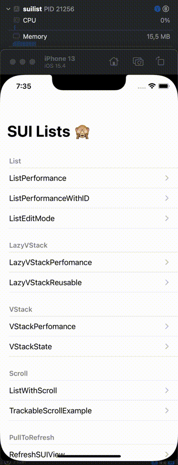
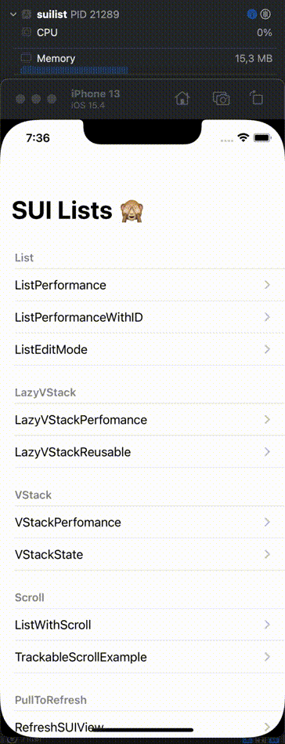
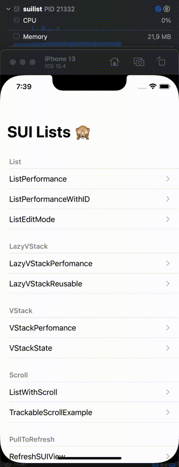
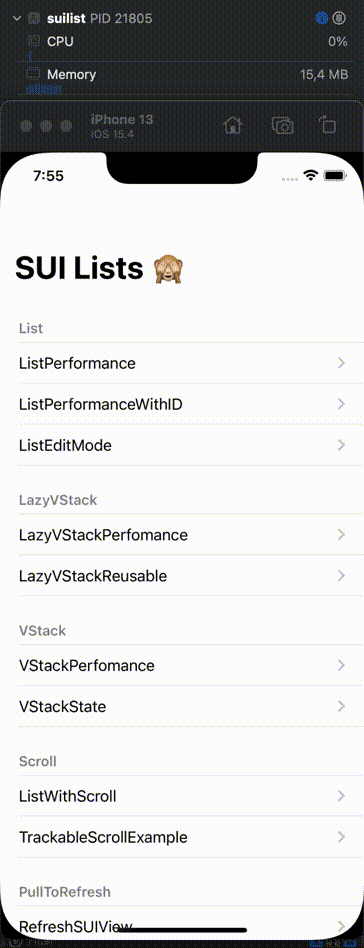
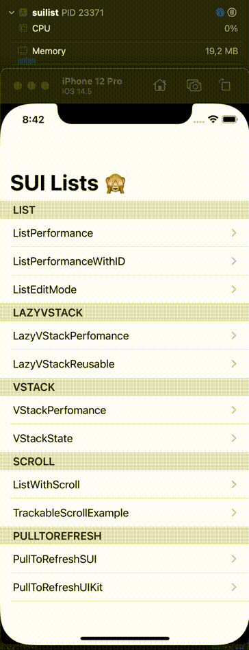

# suilist
Performance example List, LazyVStack, VStack

## ListPerformance 
[ListPerformance](suilist/List/ListPerformance.swift)  

## ListPerformanceWithID 
[ListPerformanceWithID](suilist/List/ListPerformanceWithID.swift)  

## ListEditMode 
[ListEditMode](suilist/List/ListEditMode.swift)  

## LazyVStackPerfomance 
[LazyVStackPerfomance](suilist/LazyVStack/LazyVStackPerfomance.swift)  

## LazyVStackReusable 
[LazyVStackReusable](suilist/LazyVStack/LazyVStackReusable.swift)  

## VStackPerfomance 
[VStackPerfomance](suilist/VStack/VStackPerfomance.swift)  

## VStackState 
[VStackState](suilist/VStack/VStackState.swift)  

## ListWithScroll 
[ListWithScroll](suilist/Scroll/ListWithScroll.swift)  

## TrackableScrollExample 
[TrackableScrollExample](suilist/Scroll/TrackableScrollExample.swift)  

## PullToRefreshSUI 
[PullToRefreshSUI](suilist/PullToRefresh/SUI/PullToRefreshSUI.swift)  
### SUI pull to refresh iOS 14

### SUI pull to refresh iOS 15

## PullToRefreshUIKit 
[PullToRefreshUIKit](suilist/PullToRefresh/Introspect/PullToRefreshUIKit.swift)  
